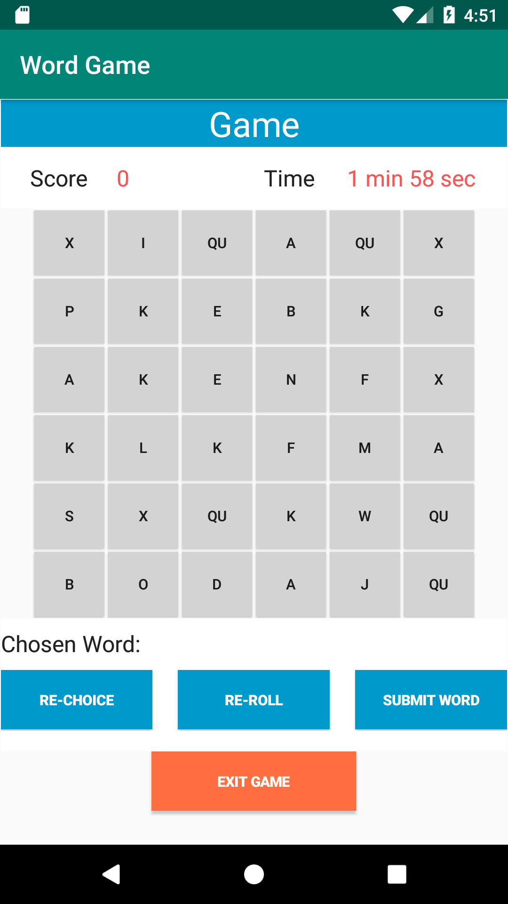

# Design Document

**Authors:**

**Team123: Tianfang Xie, Rakesh Jeyaraman, Weneyan Du**

## 1 Design Considerations

### 1.1 Assumptions

1. The user's device has the right Android operating system that corresponds to the developer's Android environment.
2. The user is familiar with using Android mobile systems and applications. 
3. The user will not make any spelling mistakes when playing with the current application.
4. This project will generate an app for a single player. There will be a database to store historical game score but not the personal information. The login/logout system will not be designed.
5. The application is not depended on any external web service. It is a simple offline game. The user can not upload or share the game score. 

### 1.2 Constraints

1. The implementation of current project will be only accessed from an Android phone and tablet device. 
2. The use of an Android Wear OS / TV / Android Auto may have serious problems and cause a crash of the app.
3. The application does not rely on any existing program of the device.

### 1.3 System Environment

1. The minimum API level is API23: Android 6.0 (Marshmallow). 
2. The environment will be entirely contained within an Android device (mobile phones), which has an Android OS with no extra-packages pre-installed.
3. The app can run on approximately 62.6% of current existing devices. 
4. During the development process, many typical Android development and testing technologies will be used for this app, such as Java, UML, SQLite etc.

## 2 Architectural Design

### 2.1 Component Diagram

The figure above shows the application design as a UML component diagram.

### 2.2 Deployment Diagram

This project uses SQLite database and has a relatively simple system structure. All components of the system will be deployed on a single Android device. The deployment diagram is shown here.

## 3 Low-Level Design

### 3.1 Class Diagram

The figure above shows the application design as a UML component diagram.

### 3.2 Other Diagrams

Currently, the other diagram seems redundant.

## 4 User Interface Design

The figure above shows the Main Menu UI design in Android Studio Emulator.

The figure above shows the Game UI design in Android Studio Emulator.

The figure above shows the Settings UI design in Android Studio Emulator.

The figure above shows the Statistics UI design in Android Studio Emulator.

The figure above shows the Score Statistics UI design in Android Studio Emulator.

The figure above shows the Word Statistics UI design in Android Studio Emulator.

<!--stackedit_data:
eyJoaXN0b3J5IjpbMTYyODQ5NTM1MF19
-->
