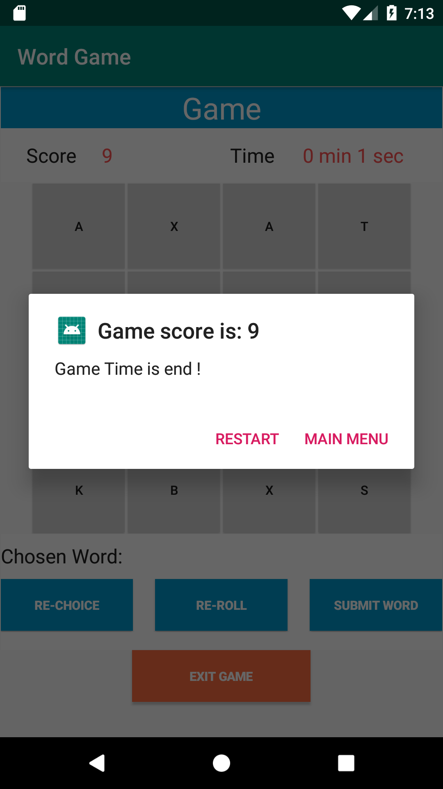

# User Manual for Word Find 6300

**Authors:**

**Team123: Tianfang Xie, Rakesh Jeyaraman, Weneyan Du**
## 1 Introduction

This is a mobile app that allows a single user to set, play and review a word game. The score of the game is based on if the player can select correctly words from a randomly generated board, the time settings and the times of reset.

## 2 Main Menu

At the main menu of this app, there are five buttons, "Play Game", "Adjust Setting", "View Statitstics", "Reset Database" and "Exit".
When first entering the game, the player can choose either to "Play Game" or "Adjust Settings". "Play Game" and "Adjust Settings" lead to an interface to play the game and adjust the settings, respectively.

"View Statistics" can be used to show either "Word Statistics" or "Game Statistics" after the user played one or multiple games. Details will be introduced in the section "View Statistics".

"Reset Database" will reset all the settings to their default values and clean all the historical game score data.

"Exit" will exit the app.

## 3 Adjust Settings

Before playing the game, the user can choose to "Adjust settings" first. 

After entering the game setting screen, the default settings for this game will be shown. The spinners will automatically choose 3 minutes for the game to end, 4X4 for board size and weight of 1 for the letters which is shown in the above picture. If it is the first time ever that the player enters the game or if the player clicked "Reset Database", the game will use default settings.

Users can change all three settings into different values by clicking the drop down menu and select the values they desire. After choose the setting values, the user need to click the "Submit Settings" to save the selection. Remember, if the player wants to choose the weights for the letters, the user needs to use the spinner to choose the letter first, and then choose the corresponding weight by clicking the drop down menu shown on the right. After choose each letter and its weights, the player needs to click the "Submit Setting" button to confirm the changes of settings. The user can also click the "Reset Settings" button to change all the settings to the default values. The current selection will be displayed through the table undernearth "Submit Settings" and "Reset Settings" buttons, which is showing in the picture below.

The corresponding "Play Game" interface is shown as the following picture. 

After the selection, click "Return to Menu" to go back to the main menu.

## 4 Play Game

As illustrated above, if the user decided to play game directly without adjusting the settings, then the game will be set to the default settings (for the first time ever play) or the recorded settings from the previous play (According to the project requirements, the game will use the last correctly settings to begin the game to maintain the persistence between runs.). Please refer to "Adjust Settings" sections for more details. Otherwise, the game will be set to settings user selected in "Adjdust Settings" interface. 

In order to play the game, the user can click "Play Game" from the main menu, as shown below.

Once entered the game (see picture below), a timer will show to count down time till the end of the game.While the real-time score is shown on the left top corner, the timer is shown on the right top corner. Underneath them is a board created according the settings. This is the main area to play the game, which will be introduced in details in following paragraphs. Under the board, is a section to display the word chosen by the user. Following that are three bottons: "Re-choose", "Re-roll" and "Submit word". Use "Re-choose" to un-select the letters have been chosen when the user is not satisfied with his/her choice. Use "Re-roll" to reset the board when the user run out of word choices (Points will be deducted when re-roll. See descriptions below.). Use "Submit word" to submit the chosen word. Score will be recorded in this process as well. The last button at the bottom of the page is "Exit Game". Click on it will go back to main menu.

### 4.1 Choose the letters

To play the game, the user need to recognize word that made from consecutive letters on the board. User can label the selected letter by clicking on the letter. Then the selected letter will turn in green. The letters selected in the chain should be neighboring with each other, as showing in the picture below. The letters been clicked will be displayed in the "Chosen Word" field. In this particular case showing below, letter "Q" will be shown as "QU" and counted as two letters. For the rest of the letters, it will be shown as it is and counted as one letter.

The player can only choose the letters from the board that are adjacent to each other (horizontally, vertically, or diagonally), if the player wants to choose the letters that are not adjacent, a warining message will be shown on the screen, and the player will not be able to choose that letter.

For example, the player already choose the letters "AJMTY" from the board, if the player wants to choose any letter other than the surrounding four (A, L,S C), the warning message will shown to indicate that it is not adjacent to the previous chosen letter "Y". The plot is shown as below.

### 4.2 Unchoose the letters

User can also unselect the letter by clicking the selected letter again. Then the letter will turn back to grey color, which is shown below.

Only the latest letter chosen can be unchoose. If the player try to unchoose the letter other than the latest clicked one, a warning dialog will be shown. In the case below, the last clicked letter is "A", if the player click on "M" or "K", a massage stating "Only the latest letter can be unclicked" will show.

### 4.3 Submit the letters

The player needs to use "submit word" button to submit the word and get scores. Once the word been subbmitted (by clicking "Submit Word" button) and met the criteria (mininum two letters, letters selected should be neibouring with each other), in "Chosen Word" field will show "word submit successfully", and all the selected letters will become un-selected staus, shown as below.

The minimum number of letters of a word that can be submitted is two, the null and the single letter word can not be submitted. There will be a warning dialog shown as below.

If the player choose the same letters at the same locations to generate a same word and submit that for the second time, a warning dialog will be shown as below, and the word can not be submitted twice. But the player can use other letters at differet loactions to generate a same word.

### 4.4 Rechoose letters (clear all current selected letters)

If the player makes many mistakes when choosing the letters, or the player wants to quickly un-select all the chosen letters, the player can click the "re-choice" button, and all the selected letters will become un-selected status, but the board will maintain the same, shown as below.

### 4.5 Reset the board

If the player run out of words to choose from the current board, the player can click the "re-roll" button to reset the board, shown as below. 5 points will be deducted from the total score for each re-roll.

### 4.6 End game

When the timer run to the end, the game ends. A massage will show on the screen "Game Time is end!". Also the game score will show. User can choose to "Restart" the game or to go back to "Main Menu", as shown below.

If user click "Exit Game" while playing the game, game score will show on the screen. User can choose to see "Statistics", to "Restart" the game or to go back to "Main Menu", as shown below.

## 5 View Statistics

User can "View Statistics" from main menu or during game playing, which is described above. "View Statistics" consists of three buttons, "Score Statistics", "Word Statistics" and "Return to Menu", as shown below. 

User will see "Final Game Score", "Game Reset Times" and "Number of Words Entered" in "Score Statistics" in descending order by final game score. User can click these scores to see other detailed settings and related informations. User can also choose to "Return to Statistics" or "Return to Menu", as shown below.

User will see "Most Frequently Played Word" and "Number of Word Played Times" from all the games in "Game Statistics". User can also choose to "Return to Statistics" or "Return to Menu", as shown below.

## 6 Reset the database

This app uses SQLite database to store the game settings and historical game status. After playing many times, the statistics information may become a huge list to view. The player can click the "Reset Database" button on the main menu to reset the database. A warning dialog will be shown to double check the action. The player needs to press "OK" button to reset the database, or can press the "Cancel" button to cancel the reset. If the player choose to reset, the game settings will go back to default values and all historical game information will be cleaned, shown as below.

